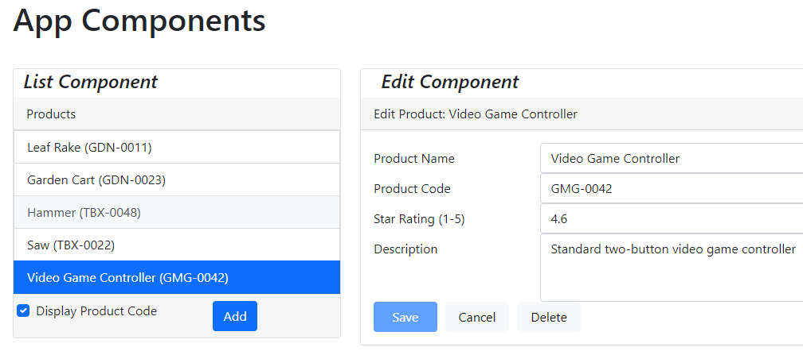
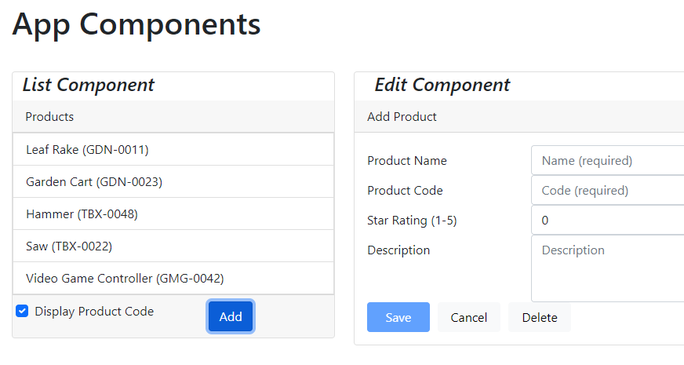
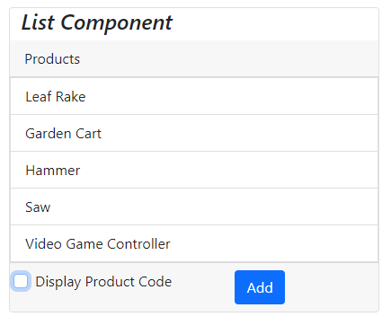
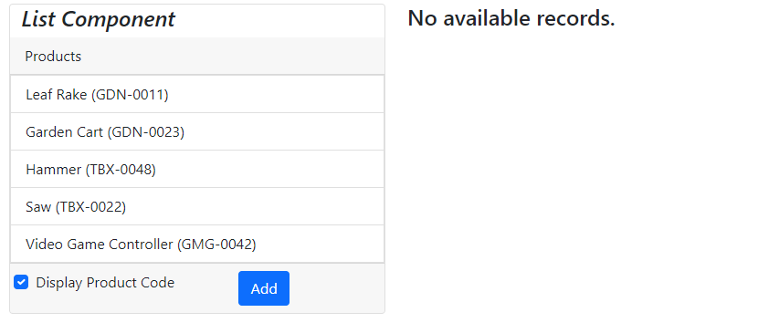
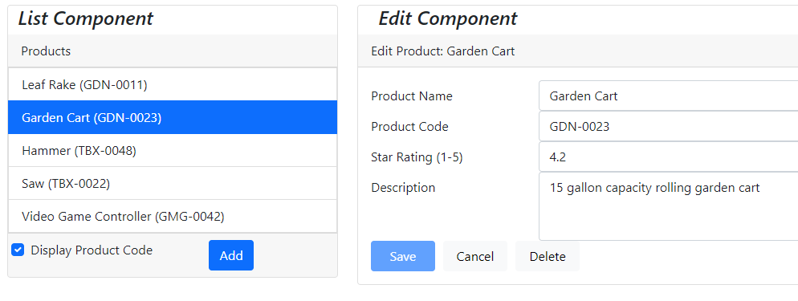
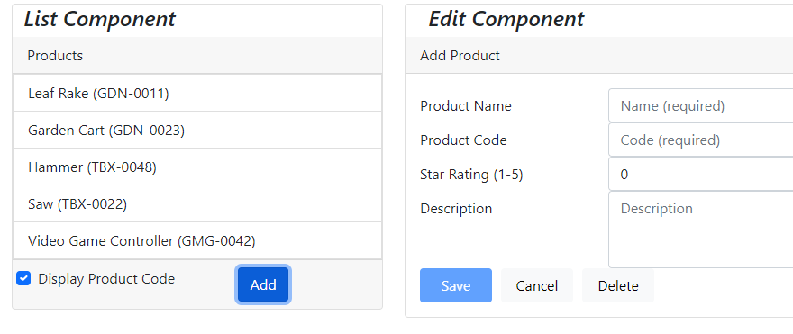
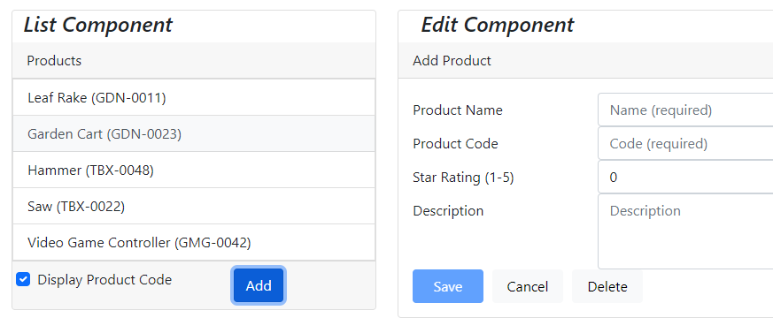
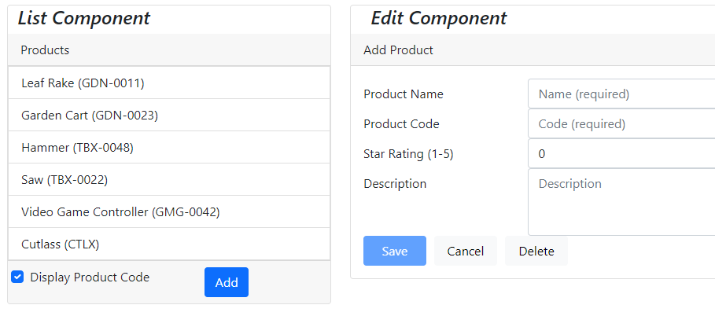

# Implement of NgRx in Angular 17

 

Above is the pictures showing a simple application and how NgRx was used to implement CRUD operator using the [Angular-in-memory-web-api](https://www.npmjs.com/package/angular-in-memory-web-api) to fake a backend, since we want to focus only on the FrontEnd of the application.

## Actions carried out

There are basically five(core) action carried out, leveraging the benefit of NgRx and they are all working seemlessly

1. Toggle product code.
2. Set current product.
3. Clear current product.
4. Initialise current product
5. Create product

## Toggle product code

 

From the above image, if we carefully observe product code is missing from the second image and below the "Display Product Code" checkbox was unchecked

## Set current product

 

Carefully observing the image above, we see the "No available record" that is because no record has been set by clicking on any of the listed product on the List Component, but on the Second image the selected image is the highlighted on, and it's details are showing on the left hand of the second image

## Clear current product

When we click the delete button we don't neccessary delete from the in-memory database(not yet implemented) but we just set current product to null, and we move back to the first image from the two image directly above.

## Initialise current product

When we click on the Add button a new form(Reactive) in populated requesting us to input a value.

## Create product

After we fill out the form and click on the Save button we add the detail to the in-memory database.

 

If we observe the images above, you will notice that the Cutlass was not added but on the second image it was created.

NB: Delete current product from the angular-in-memory-web-api has not being implemented.

## Further help

To get more help on the Angular CLI use `ng help` or go check out the [Angular CLI Overview and Command Reference](https://angular.io/cli) page.

## Tools
[Angular](https://angular.dev/)
[NgRx](https://ngrx.io/)
